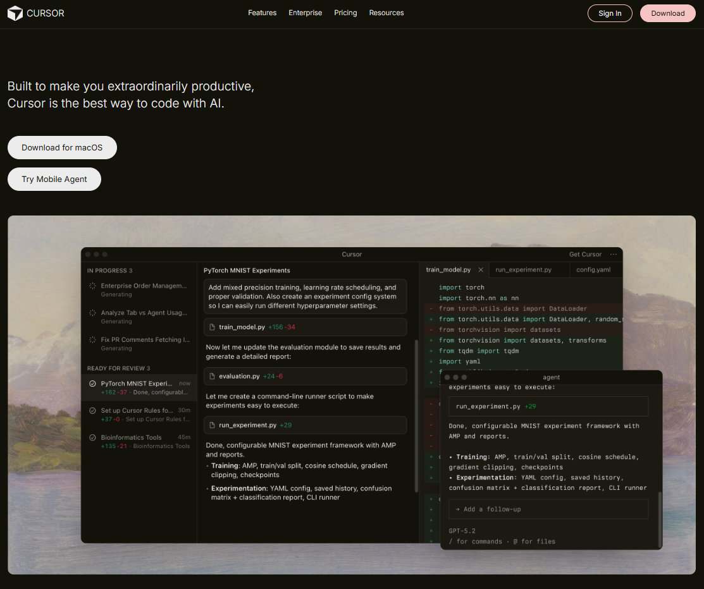
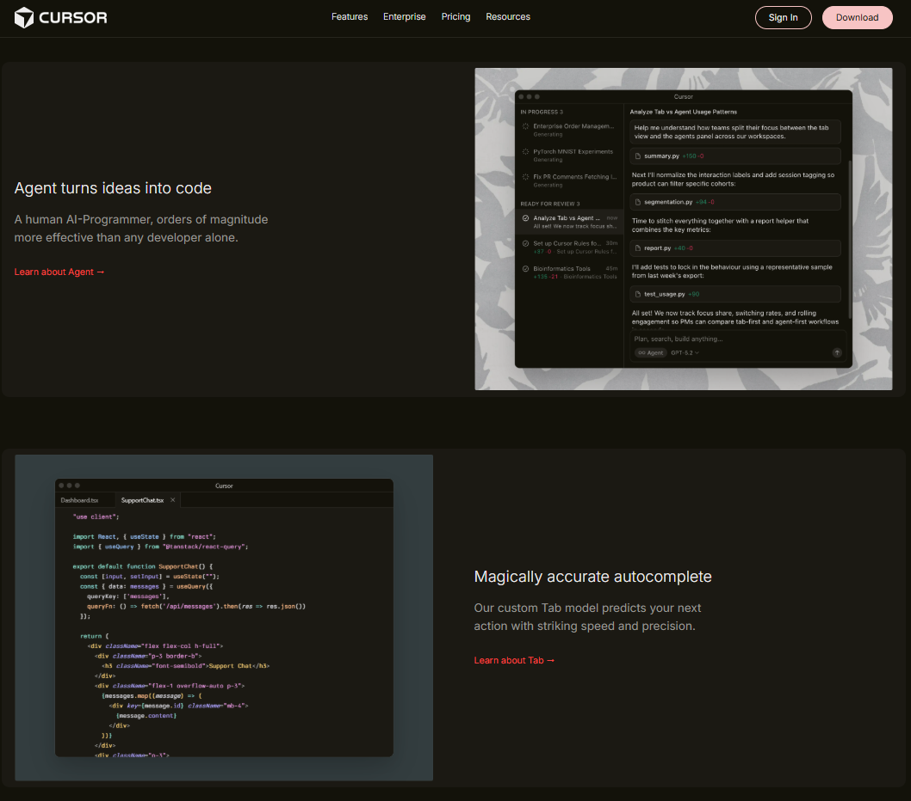
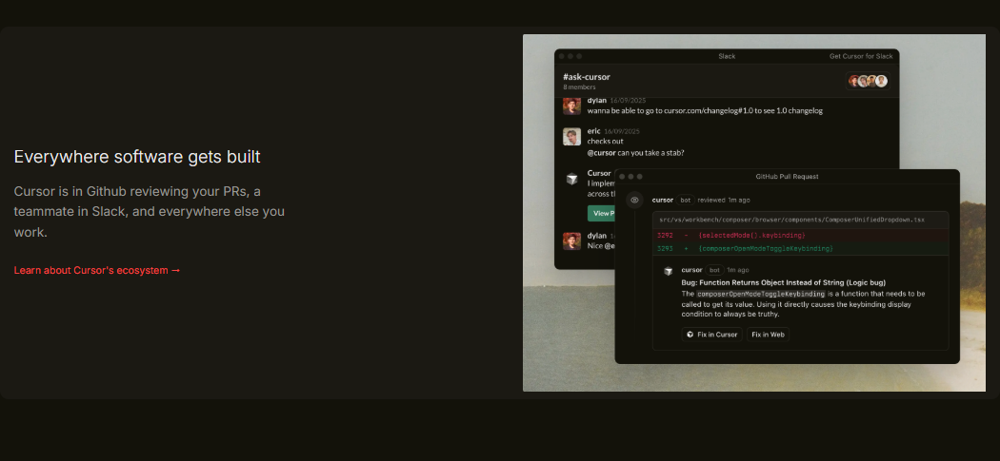
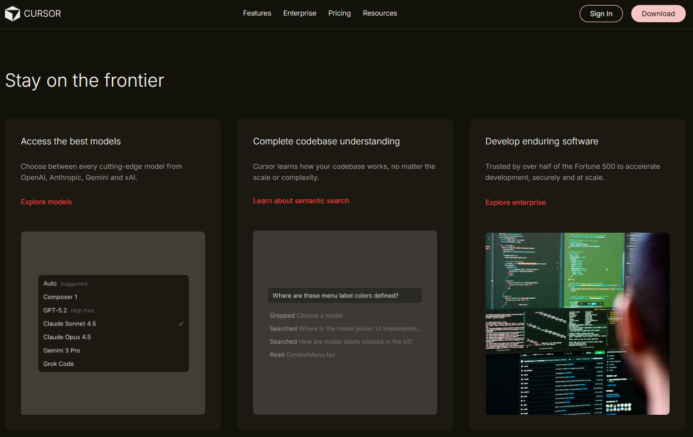
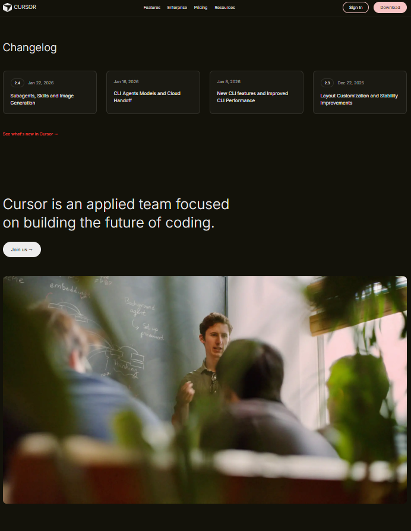
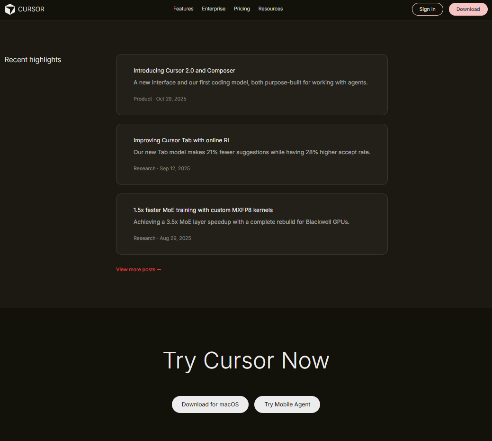
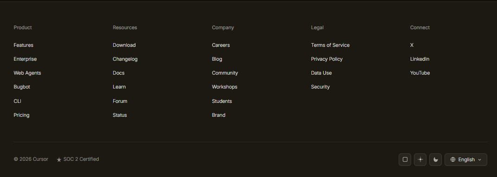

# Cursor Landing Page Clone

A pixel-perfect recreation of the Cursor.ai landing page, built with pure HTML, CSS, and vanilla JavaScript. This project showcases modern web development techniques including CSS Grid, responsive design, and smooth animations.

## 🎯 About

This is a practice project where I rebuilt the Cursor landing page to improve my frontend development skills. The goal was to match the original design as closely as possible while writing clean, maintainable code.

## ✨ Project Preview










## ✨ Features

- **Responsive Design** - Works seamlessly on desktop, tablet, and mobile devices
- **3D Tilted Mockups** - Feature sections with perspective-transform effects on images
- **Smooth Animations** - Fade-in effects and hover transitions throughout
- **Clean Code** - Well-organized HTML and CSS with proper naming conventions
- **Accessible** - Semantic HTML5, ARIA labels, and keyboard navigation support
- **Performance Optimized** - Lazy loading images and efficient CSS

## 🛠️ Technologies Used

- HTML5
- CSS3 (Grid, Flexbox, Custom Properties)
- Google Fonts (Inter)

## 📁 Project Structure

```
cursor-landing-page/
├── index.html          # Main HTML file
├── style.css           # All styles and responsive design
├── assets/             # Images and icons
│   ├── CUBE_2D_DARK.png
│   ├── Screenshots/
│   ├── logos/
│   └── previews/
└── README.md           # You are here
```

## 🚀 Getting Started

1. **Clone the repository**
   ```bash
   git clone https://github.com/yourusername/cursor-landing-clone.git
   cd cursor-landing-clone
   ```

2. **Open in browser**
   - Simply open `index.html` in your web browser
   - No build process or dependencies required!

3. **Or use a local server** (recommended)
   ```bash
   # Using Python
   python -m http.server 8000
   
   # Using Node.js
   npx serve
   ```

## 🎨 Key Design Elements

### CSS Variables
The project uses CSS custom properties for easy theming:
- Colors (primary, secondary, accent)
- Spacing scale (8px to 96px)
- Typography sizes
- Border radius values
- Transition speeds

### Feature Sections
The feature sections use CSS 3D transforms to create the tilted mockup effect:
- `perspective: 2000px` for 3D space
- `rotateY()` and `rotateX()` for tilt angles
- Layered box shadows for depth
- Smooth hover animations

### Responsive Breakpoints
- **Mobile**: < 768px
- **Tablet**: 768px - 1023px
- **Desktop**: 1024px+

## 📝 What I Learned

Building this clone helped me improve in several areas:

1. **CSS Grid mastery** - Complex layouts with alternating content
2. **3D CSS transforms** - Creating depth and perspective effects
3. **Responsive design patterns** - Mobile-first approach
4. **Design system thinking** - Using CSS variables effectively
5. **Performance optimization** - Lazy loading and efficient selectors

## 🐛 Known Issues

- Mobile menu needs JavaScript implementation (currently just a toggle button)
- Theme switcher buttons are visual only (no actual theme switching yet)
- Some animations could be smoother on lower-end devices

## 🔮 Future Improvements

- [ ] Add dark/light theme toggle functionality
- [ ] Implement mobile navigation menu
- [ ] Add more micro-interactions
- [ ] Optimize images with WebP format
- [ ] Add loading states and skeleton screens
- [ ] Implement smooth scroll animations with Intersection Observer

## 🙏 Credits

- **Original Design**: [Cursor.ai](https://cursor.ai)
- **Developer**: Akash Kumar Singh
- **Fonts**: [Inter](https://fonts.google.com/specimen/Inter) by Google Fonts

## 📄 License

This is a practice project for educational purposes. All design rights belong to Cursor/Anysphere, Inc.

---

**Note**: This is a personal learning project and is not affiliated with or endorsed by Cursor or Anysphere, Inc.

## 💬 Contact

Feel free to reach out if you have any questions or suggestions!

- GitHub: [@Akashkr28](https://github.com/Akashkr28)
- Email: email.akash2010@gmail.com

---

Made with ❤️ and lots of ☕ while learning frontend development